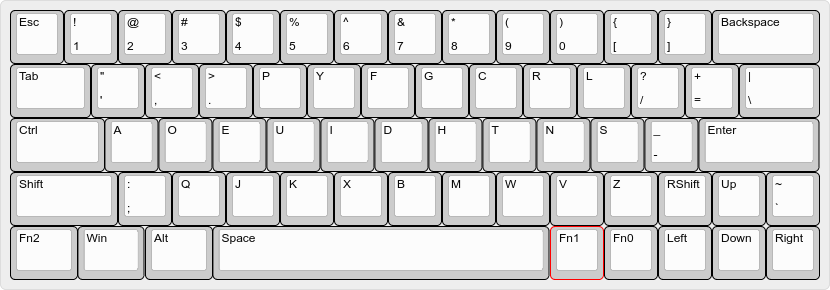
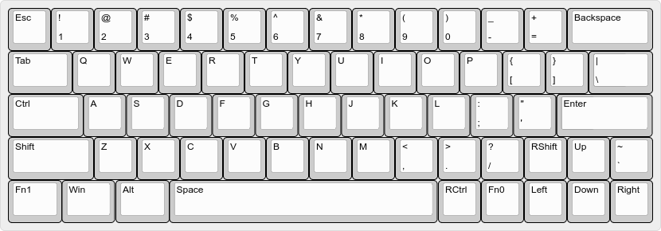
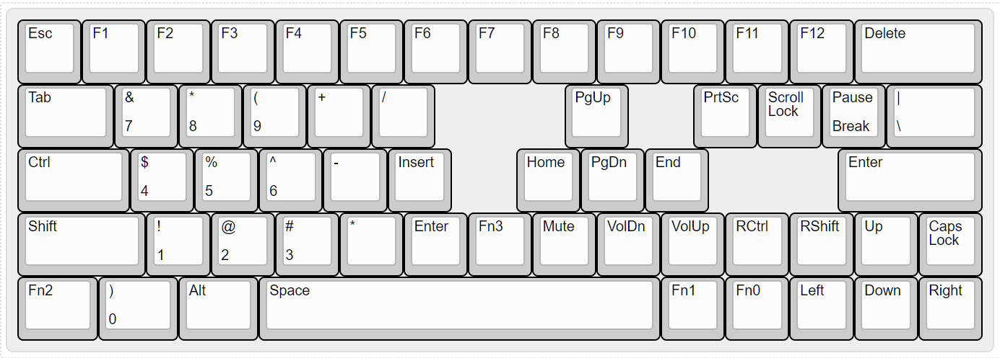
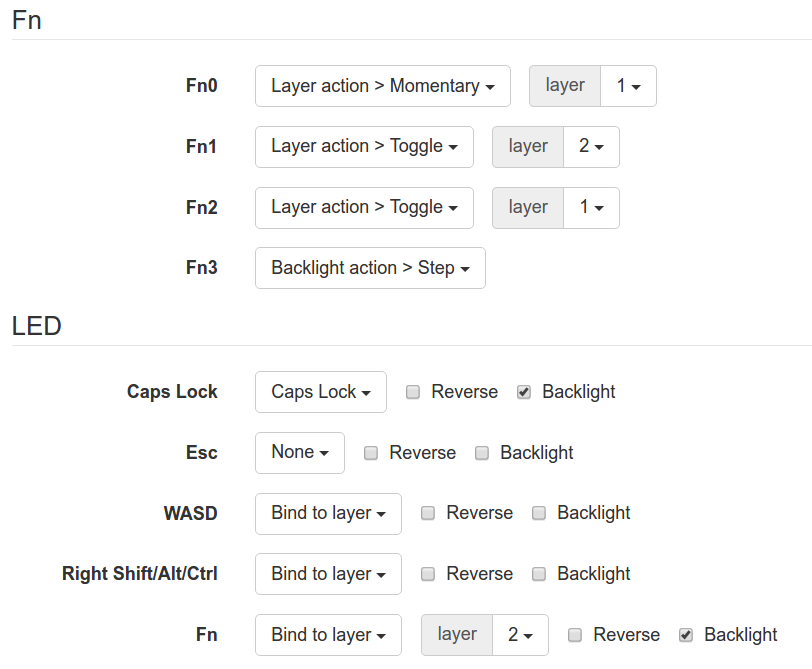

# XD60
XD60 is inheritance from eepw. It has native direction keys.

### tkg-toolkit
In Linux:

    cd linux
    ./setup.sh
    ./refresh.sh eppFilePath
setup.sh, First step, select **GH60 RevA/B/C**.

### Dvorak Base

### US Base

### Function Keys

### Fn and LED Config

[generated .epp file](./keymap.eep)

